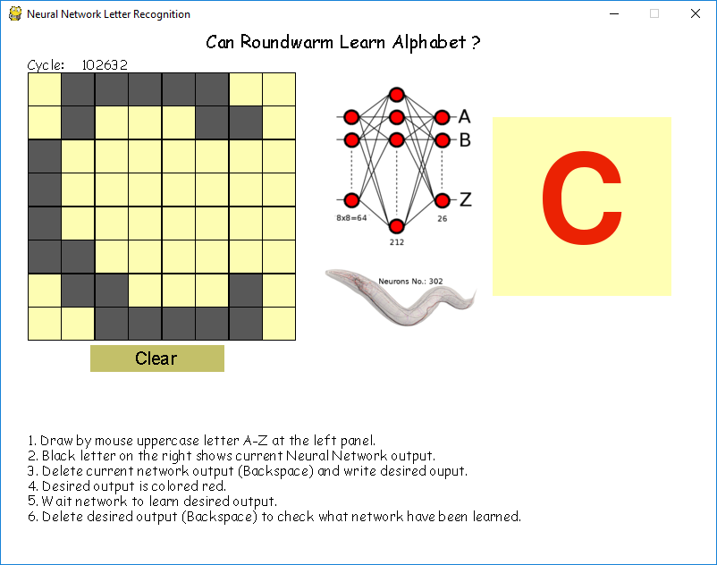

# Neural Network Image Recognition
### Trivial demonstration that smal neural network similar to roundworm can learn alphabet

## Introduction
This software demostrates that small neural network equivalent to the nervous system of roundworm by number of neurons 
can learn english alphabet. 

It was designed from scratch and uses [multilayer perceptron](https://en.wikipedia.org/wiki/Multilayer_perceptron) 
neural network with one hidden layer.
Inputs are excitations from the 8x8 visual field (0 or 1), whitch gives 64 neurons in input layer.
Hidden layer has 212 neurons.
Output layer represents one-hot vector encoding for letters from A to Z (uppercase), and thus number
of output neurons are 26.

Total number of neurons is 302 which is equivalent to [number of neurons of roundworm](https://en.wikipedia.org/wiki/List_of_animals_by_number_of_neurons).

## Run

Start main.py file from src folder. Make sure that Requirements section are satisfied.
From windows console:  
C:\path_to_main> python main.py

Using of user interface is descripbed in help text at the bottom of the window.  
Be paitient while train network and have good fun!

## Requirements

1. Python 3.6.4
2. Pygame 1.9.3

## References
[1] ['List of animals by number of neurons'](https://en.wikipedia.org/wiki/List_of_animals_by_number_of_neurons) , Wikipedia,  
[2] ['Multilayer Perceptron'](https://en.wikipedia.org/wiki/Multilayer_perceptron), Wikipedia,  
[3] ['Open Worm'](http://openworm.org/)
